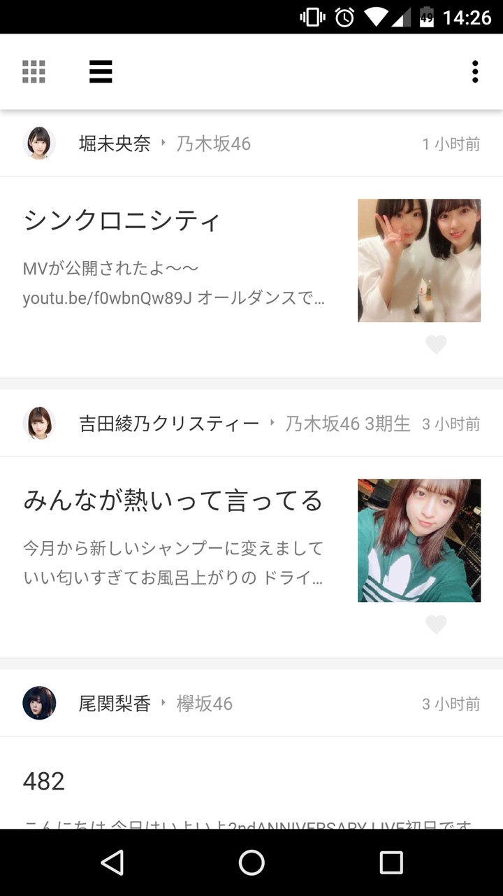
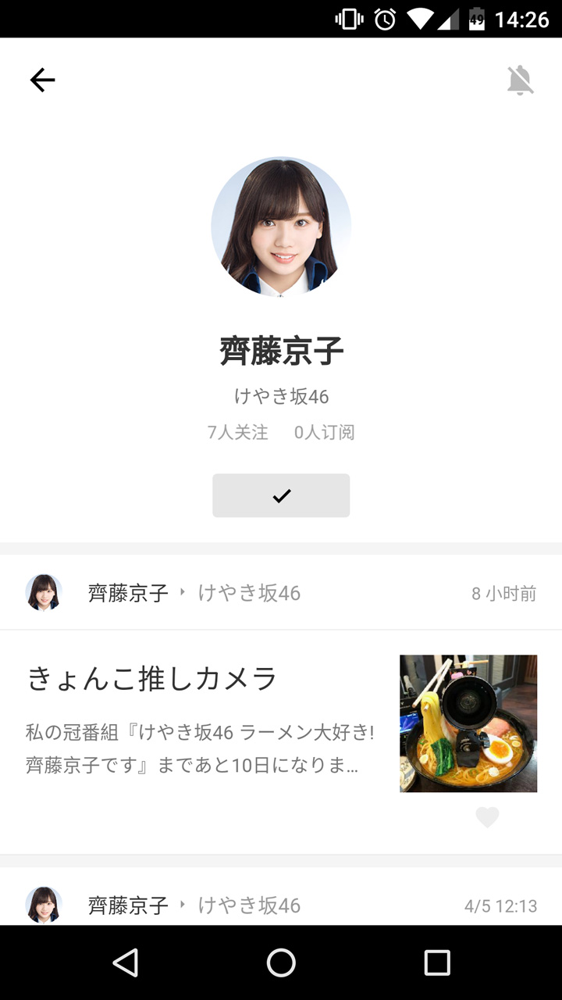

# idol 开发版

依旧是坂道系官博聚合阅读平台

开发版的意思就是......还没写完......写完还早着呢TAT

现在平台的UI来源于早就凉了的豌豆荚轻桌面

开发版换成了其后的"豌豆荚一览/轻芒阅读"安卓版(也凉的差不多了)

因为平台和轻芒的关注订阅功能比较相似

而且之前的设计不太好拓展这些功能

所以有这个现成的"设计稿"就用了吧

~~自己设计是不可能的，这辈子都不可能再做设计的~~

### 闲谈

离现在这张lets encrypt证书过期还有不到一星期

也就是说我重构完爬虫和后端到现在都快三个月了

这段时间真的好多好多事，感觉已经把大四学生的所有选择都经历了一遍

真的没时间给我好好把这些个还算有点技术含量的东西写完，再学个框架

结果还是些年久失修的项目，希望面试官不会去看我原来的智障代码

很多时候都没得选择，希望自己这样走没问题吧

### 实现

还是原来的技术栈 aiohttp + mysql + es5

辣鸡如我依旧不会框架，还是非常原始的建DOM操作DOM

我会用自己的想法造个SPA出来

还是想用PWA代替native（因为不会），所有一直尽力复原原生的交互（虽然性能捉鸡）

不得不说写JS来响应触控事件实在太痛苦了

希望我能把这个做出来吧

### 代办

好多好多

- SwipeRefreshLayout
- PhotoSwipe
- Hash Jump
- 关注页、添加页
- 更新与未读
- 展开的过渡动画
- 夜间模式
- 设置页
- Service Worker
- 订阅与Web Push
- Web Share

### 预览

### 许可
MIT
